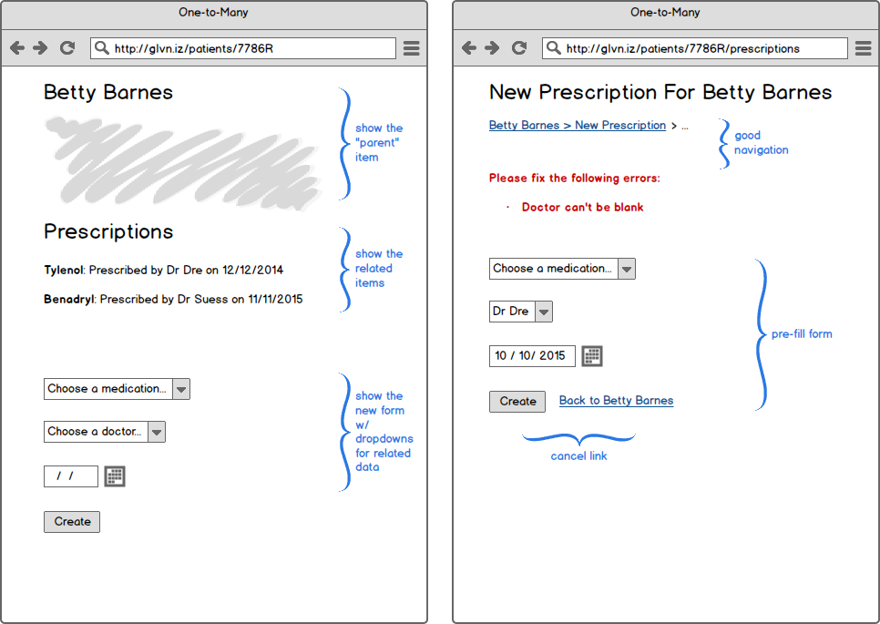

# Associations Summative Assessment

Alright!  You've gone through all of the following repos:

1. Modeling Data: https://github.com/gSchool/modeling-data
1. Nested Callbacks: https://github.com/gSchool/asynchronous-js-nested-callbacks
1. Mongo Associations w/ References: https://github.com/gSchool/mongo-associations
1. Promises: https://github.com/gSchool/javascript-promises
1. Associated Objects https://github.com/gSchool/express-mongo-associated-objects

And it's time to show what you can do!

## What is "Summative"?

It means you shouldn't move on until you can do this successfully.

It also means that you should be able to do all of this on your own, without direct assistance from instructors or classmates.  If you are stuck, it may mean that you missed steps from earlier repos, so consider re-doing exercises from earlier in the unit and then coming back to this app after having practiced more.

## Requirements

You must build an express/mongo app that:

- Has at least one one-many relationship
  - Must use referenced documents, not embedded documents
  - Must display both the "parent" and the "children" on the same page
- Has at least one many-to-many relationship
  - Must use an array of ids in one of the collections
  - Must display the "parent" and the "children" on the same page
- Has a complete and correct ERD diagram that describes your model
  - Can be a whiteboard drawing you took a picture of
- Allows users to CRUD all of the models in the app
  - See UI patterns for suggestions
- Server-side validations on all objects
  - simple required-field validations will work

In code, your app must:

- use all promises (no callbacks allowed!)
- not have _any_ references to Monk or Mongoose in your routes files
  - _all_ db-related calls must be in files in your `./lib` directory

You may choose which problem domain to model.  If you have an existing personal project that meets 100% of these criteria, you may submit that as well, but c'mon, you could use the extra practice!

## Instructions

1. Create a public repo with your express app
1. Deploy to Heroku or Bluemix or run.pivotal.io (Cloud Foundry) or your own unix server
1. Create a project in students.galvanize.com and add your public repo and your deployed URL
1. Add your ERD diagram to the repo and embed it in the README
1. Get the app fully working within 72 hours

## UI Patterns

While your app may use whatever UI you can think up that matches the requirements, here are two very common UI patterns for one-to-many and many-to-many associations:

**One-to-many**


**Many-to-many**



## Route Conventions

Assume you have an `albums` collection that has associated `songs`.  Routes for nested resources typically follow a pattern similar to this:

```
GET   /albums/:albumId/songs (optional)
GET   /albums/:albumId/songs/new (optional)
POST  /albums/:albumId/songs
GET   /albums/:albumId/songs/:id (optional)
GET   /albums/:albumId/songs/:id/edit
POST  /albums/:albumId/songs/:id
POST  /albums/:albumId/songs/:id/delete
```

Notice the common `/albums/:albumId` portion of that route?  Express makes this easy using `app.use` to mount song routes at that prefix.  It also allows you to use route-level middleware to find the `album` by its `:albumId` before all `song` routes.  Not required, but it's there and it's awesome :)

## Acceptance Criteria

Assume that your one-to-many relationship is between Album and Song.  You should test your app like so:

- Try to create an album without filling in any fields
  - Expect to see validation errors above the form
- Fill in valid fields on an Album and create
  - Expect to see an album show page with a link / form to add a song
- Try to create a song without filling in any fields
  - Expect to see validation errors
  - Expect the URL to have the `/albums/:albumId` prefix
  - Expect to either be on a new page, or to the album page as it was before
- Create a song successfully
  - Expect to see the list of songs on the albums show page
- Remove a song
  - Expect to see the song removed correctly
- Edit a song
  - Test with validation errors and a successful update
- Delete an album
  - Ideally also delete any related songs

The list goes on... But be thorough in your testing.
